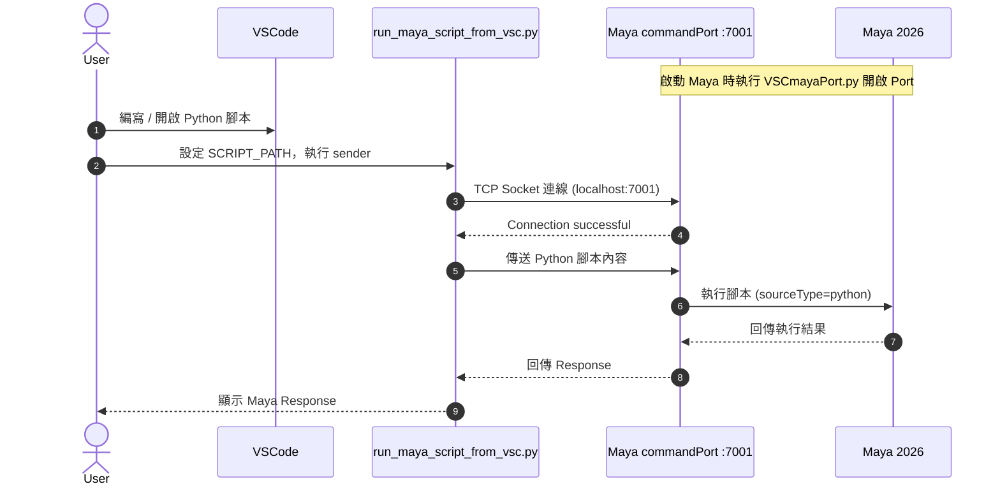
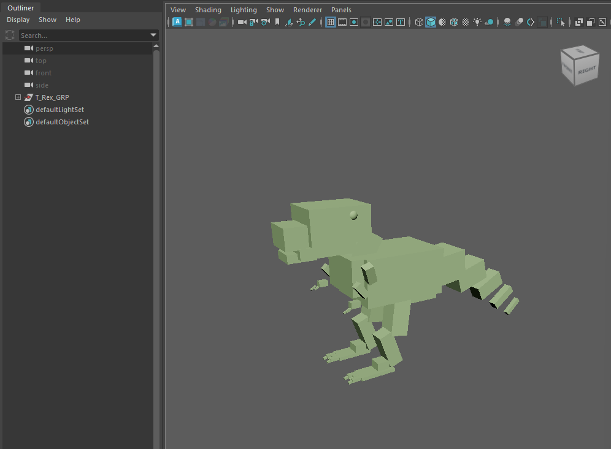

# MayaMCP — VSCode to Maya 2026 Scripting Workflow

用 **VSCode** 撰寫 Python 腳本，透過 TCP Socket 即時傳送並在 **Maya 2026** 中執行。

---

## 工作原理



---

## 環境需求

- Autodesk Maya 2026
- Python 3.x（Maya 內建）
- VSCode（任意版本）

---

## 使用步驟

### Step 1：開啟 Maya，啟動通訊埠

每次開啟 Maya 後，必須先執行一次 `VSCmayaPort.py` 來開啟 port 7001。

1. 開啟 **Maya 2026**
2. 在頂部選單點選 **Windows → General Editors → Script Editor**
3. 在 Script Editor 中，切換到 **Python** 標籤
4. 將 `Script_maya/VSCmayaPort.py` 的內容貼入，然後按 **執行（Ctrl+Enter）**
5. 看到以下訊息代表成功：

```
--- 設定完成！通訊埠 :7001 已在 Python 模式下成功開啟。Maya 已準備就緒。 ---
```

> **注意：** 只要 Maya 沒有關閉，此步驟只需執行一次。重開 Maya 後需再次執行。

---

### Step 2：在 VSCode 設定要執行的腳本路徑

開啟 `run_maya_script_from_vsc.py`，修改 `SCRIPT_PATH`，指向你想執行的 Python 腳本：

```python
# 修改這裡，指向你想在 Maya 中執行的腳本
SCRIPT_PATH = r"C:\your_path\Script_maya\build_trex.py"
```

---

### Step 3：從 VSCode 執行腳本，傳送至 Maya

在 VSCode 的終端機（Terminal）中執行：

```bash
python run_maya_script_from_vsc.py
```

執行成功後會看到：

```
Attempting to connect to Maya (Port: 7001)...
Connection successful!
Reading script: '...\build_trex.py'
Sending script to Maya for execution...
--- Script execution complete ---
```

Maya 視窗中會同步出現執行結果。

---

## 腳本說明

| 檔案 | 用途 |
|------|------|
| `Script_maya/VSCmayaPort.py` | 在 Maya 內開啟 port 7001（Python 模式），每次啟動 Maya 必須先執行 |
| `run_maya_script_from_vsc.py` | VSCode 端的傳送工具，修改 `SCRIPT_PATH` 指向目標腳本後執行 |
| `vscmayatest.py` | 連線測試腳本，確認 VSCode → Maya 通道是否正常 |
| `Script_maya/build_trex.py` | 範例：用 `maya.cmds` 建構暴龍多邊形模型 |

---

## 範例：建構暴龍模型

`Script_maya/build_trex.py` 是一個完整範例，展示如何用 `maya.cmds` 的基本幾何體（polyCube、polySphere）組合出一隻 T-Rex。



將 `SCRIPT_PATH` 指向此檔案後執行，Maya 場景中會出現 `T_Rex_GRP`，包含：

- 身體、胸部、臀部
- 頭部、頸部、頷骨、眼睛
- 5 節漸細的尾巴
- 迷你手臂與爪子
- 大腿、小腿、腳掌與趾爪
- 深橄欖綠 Lambert 材質

---

## 常見問題

**Q: 執行後出現 `Connection refused`？**  
A: Maya 的 port 7001 尚未開啟。請回到 Step 1，在 Maya Script Editor 重新執行 `VSCmayaPort.py`。

**Q: Maya 沒有反應但 VSCode 顯示成功？**  
A: 確認 port 是以 **Python 模式**開啟（`sourceType='python'`）。若之前用 MEL 模式開過，需先關閉再重開。

**Q: 出現 `UnicodeDecodeError: cp950`？**  
A: 腳本內含 Unicode 特殊字元（如 `──`）。請改用純 ASCII 符號（如 `---`）。

**Q: 重開 Maya 後又失效？**  
A: 每次重新開啟 Maya 都必須重新執行 Step 1。可將 `VSCmayaPort.py` 的內容存入 Maya 的 **userSetup.py** 來自動化這個步驟。

---

## Maya Stubs — VSCode 自動補全設定

安裝 [maya-stubs](https://pypi.org/project/maya-stubs/) 後，在 VSCode 中撰寫 `maya.cmds` 時會有自動補全與型別提示。

**下載位置：** `maya_stubs-0.4.2` 放在專案資料夾內

在 `.vscode/settings.json` 加入以下設定（路徑改成你自己的位置）：

```json
{
  "python.analysis.extraPaths": [
    "I:\\code_jenq\\VSC_Maya\\maya_stubs-0.4.2\\maya_stubs-0.4.2\\src"
  ]
}
```

設定後如未立即生效，按 `Ctrl+Shift+P` → `Pylance: Restart Language Server`。

---

## 自動化 Port 開啟（進階）

將以下內容加入 Maya 的 `userSetup.py`（路徑通常在 `Documents/maya/2026/scripts/userSetup.py`），讓 Maya 每次啟動時自動開啟 port：

```python
import maya.cmds as cmds
import maya.utils as utils

def open_command_port():
    if not cmds.commandPort(':7001', query=True):
        cmds.commandPort(name=':7001', sourceType='python', echoOutput=True)
        print("Maya commandPort :7001 opened (Python mode).")

utils.executeDeferred(open_command_port)
```
